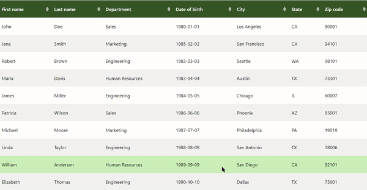

# Sortable and customizable REACT Table v2.0.2

This React module allows you to create a data table with column headers that support ascending/descending sorting.
The table is configurable, with customization options for column headers and colors.
You can easily integrate it into your project and adjust the styles to meet your needs.



<div align="center">
<br>

</div>

## Installation

```bash
npm react-sortable-customizable-table
```

## Usage

```jsx
import React, { useState } from 'react';
import ReactSortableTable from 'react-sortable-customizable-table';

export default function ParentComponent() {

    const [sortColumn, setSortColumn] = useState('');
    const [sortDirection, setSortDirection] = useState('asc');
    const data = [
        { id: 1, name: 'John Doe', position: 'Developer', startDate: '2022-01-01' },
        // other data...
    ];
    const columns = [
        { accessor: 'name', label: 'Name' },
        { accessor: 'position', label: 'Position' },
        { accessor: 'startDate', label: 'Start Date' },
        // other columns...
    ];
        //... your code

    return (
    <>
      //... your code
    
    <ReactSortableTable
        tableData={data}
        columns={columns}
        headerBgColor="#335123"
        headerTextColor="white"
        headerHoverBgColor="#444"
        headerHoverTextColor="yellow"
        headerActiveBgColor="blue"
        headerActiveTextColor="white"
        evenRowBgColor="blue"
        oddRowBgColor="yellow"
        hoverRowBgColor="#f2f2f2"
        bodyTextColor="pink"
        sortable={true} // set true or false for enable / disable sorting
        dateFormat="MM/dd/yyyy" // Customize date format
      />
        //... your code
    </>
    )
}

```

## Props

| Prop Name            | Type     | Required | Description                                                                                 |
| -------------------- | -------- | -------- | ------------------------------------------------------------------------------------------- |
| `tableData`          | array    | Yes      | The data to display in the table.                                                           |
| `columns`            | array    | Yes      | The columns of the table with `accessor` and `label`.                                       |
| `headerBgColor`      | string   | No       | Background color of the column headers.                                                     |
| `headerHoverBgColor` | string   | No       | Background color of the column headers on hover.                                            |
| `headerTextColor`    | string   | No       | Text color of the column headers.                                                           |
| `headerHoverTextColor`| string  | No       | Text color of the column headers on hover.                                                  |
| `headerActiveBgColor`| string   | No       | Background color of the active sorted column header.                                        |
| `headerActiveTextColor`| string | No       | Text color of the active sorted column header.                                              |
| `evenRowBgColor`     | string   | No       | Background color of even rows.                                                              |
| `oddRowBgColor`      | string   | No       | Background color of odd rows.                                                               |
| `hoverRowBgColor`    | string   | No       | Background color of rows on hover.                                                          |
| `bodyTextColor`      | string   | No       | Text color of the table cells.                                                              |
| `sortable`           | bool     | No       | Whether the columns are sortable. Defaults to true.                                         |
| `dateFormat`         | string   | No       | Format to display dates in. Options include 'yyyy-MM-dd', 'MM/dd/yyyy', 'dd/MM/yyyy'. Defaults to 'yyyy-MM-dd'. |

## Default style and customization

the default colors are :

- headerBgColor: #fff (white)
- headerTextColor: #000 (black)
- headerHoverBgColor: #f0f0f0 (light gray)
- headerHoverTextColor: #333 (dark gray)
- headerActiveBgColor: #ccc (light gray)
- headerActiveTextColor: #000 (black)
- evenRowBgColor: #f9f9f9 (light gray)
- oddRowBgColor: #bdc3c7 (light gray)
- hoverRowBgColor: #eaeaea (light gray)
- bodyTextColor: #000 (black)

You can customize the table's style using the props, as shown in this (horrible) usage example:

```jsx

<ReactSortableTable
  tableData={data}
  columns={columns}
  headerBgColor="#335123"
  headerTextColor="white"
  headerHoverBgColor="#444"
  headerHoverTextColor="yellow"
  headerActiveBgColor="blue"
  headerActiveTextColor="white"
  evenRowBgColor="#f2f2f2"
  oddRowBgColor="#fff"
  hoverRowBgColor="#e0e0e0"
  bodyTextColor="black"
  sortable={false} // Set to true, or omit this prop to enable sorting
/>

```

## Custom SVG Icons

The component library includes custom SVG icons that can be used within your React components. This icons can be easily customized.

### Icons Props

- `className` (string, optional): CSS class for custom styling. Default are : 'upIcon', 'downIcon', and upDownIcon.
- `width` (number, optional): Width of the icon. Default is 64.
- `height` (number, optional): Height of the icon. Default is 64.
- `fillColor` (string, optional): Color of the icon. Accepts any CSS color value. Default is 'currentColor'

### Customization

You can customize the icon's appearance by changing the width, height, and fillColor props. For example, setting fillColor="red" will color the icon red, while width={20} and height={20} will resize the icon to 20x20 pixels.

### Note

All icons in the library are SVG-based, which means they are scalable and can be styled with CSS. This ensures that they look sharp on all screen sizes and resolutions.

## Licence

This project is licensed under the MIT License. See the [LICENSE](https://opensource.org/licenses/MIT) file for more details.
